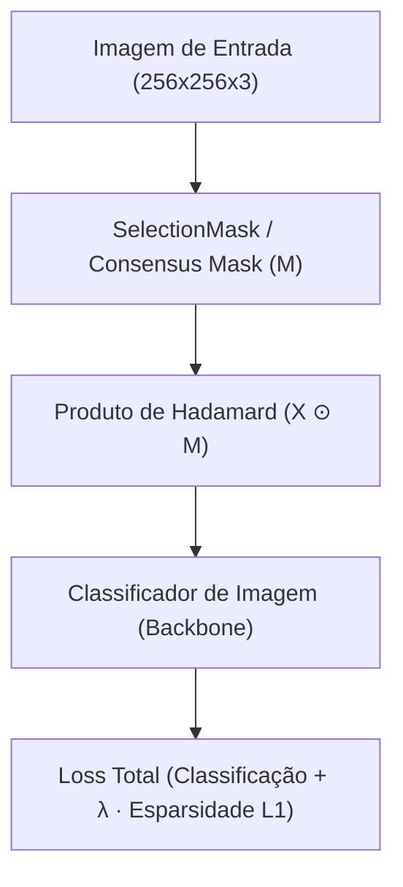
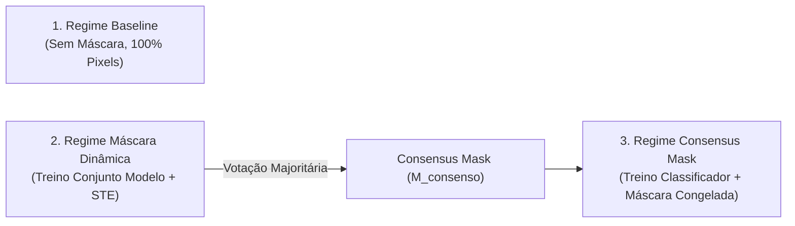

# Relatório Científico e Técnico: Projetos e Resultados ReduMask 

---

## 🚀 1. Visão Geral, Conceito e Hipóteses de Pesquisa

O projeto **ReduMask** aborda um dos principais gargalos no treinamento e implantação de redes neurais profundas em Visão Computacional: **a redundância espacial e o custo computacional de processamento de fundos irrelevantes em dados de alta dimensão**.

A abordagem propõe um módulo leve de **Máscara de Seleção Binária Aprendível** (*SelectionMask*) otimizada via **Straight-Through Estimator (STE)** em conjunto com o classificador de imagens, além de um protocolo de **Inteligência Coletiva por Votação Majoritária (Consensus Mask)**.



### As Duas Hipóteses Científicas Fundamentais:

1. **Hipótese 1 — Compressão Espacial pré-DataLoader e Eficiência de Banda:**
   * *Premissa:* Granularidades de fundo em imagens (ex: espaço profundo no astronômico Galaxy10 ou pratos/mesas no Food-101) contêm redundância.
   * *Objetivo:* Aprender um filtro espacial estático que elimine entre 40% e 90% dos pixels periféricos antes da transmissão ou inferência, com perda marginal de acurácia.
2. **Hipótese 2 — Regularização Espacial e Herança de Conhecimento:**
   * *Premissa:* Ao "cegar" o modelo para ruídos de fundo, a máscara atua como um regularizador espacial robusto.
   * *Objetivo:* Mitigar a tendência ao *overfitting* em modelos profundos e permitir que modelos leves herdem o mapa de atenção espacial construído por redes mais complexas.

---

## 🛠️ 2. Arquitetura Lógica e Estrutura Técnica do Código

O repositório foi construído em **PyTorch** com modularidade e rastreabilidade total.

```
src/
├── models/
│   ├── SelectionMask.py      # Módulo da máscara treinável via STE
│   ├── LeNet256.py           # LeNet adaptada para 256x256
│   ├── ResNet20.py           # ResNet-20 para visão computacional
│   ├── ResNet34.py           # ResNet-34 profunda
│   └── SimpleCNNRGB.py       # CNN leve de 3 camadas RGB
├── utils/
│   ├── TrainingConfig.py     # Gerenciamento central de hiperparâmetros (PyTorch DataLoader)
│   ├── DatasetsDict.py       # Carregador e transformador unificado (Galaxy10, Food-101, CIFAR-10)
│   ├── TotalLoss.py          # Loss = Loss_CE + λ · Mask_L1_Sparsity
│   ├── LambdaScheduler.py    # Scheduler adaptativo com paciência para o fator λ
│   └── StaticMaskTraining.py # Loop de treino conjunto (Modelo + Máscara)
└── scripts/
    ├── train_classifier.py   # Treinador flexível (Baseline ou Máscara Congelada)
    ├── generate_consensus_mask.py # Agregador de votação majoritária (Consenso)
    ├── extract_metrics.py    # Extrator automatizado de métricas em Markdown
    └── plot_training_log.py  # Gerador de gráficos de tradeoff (Loss vs. Esparsidade vs. Acc)
```

### 🧮 Formulação Matemática dos Módulos Principais

#### A. Straight-Through Estimator (STE) em `SelectionMask.py`
Como a função $\text{round}()$ possui derivada nula em quase toda parte, utiliza-se a aproximação de identidade no gradiente durante o *backward pass*:

$$\text{Forward Pass: } M = \text{round}(\sigma(W)) \in \{0, 1\}^{C \times H \times W}$$

$$\text{Backward Pass (Gradiente): } \frac{\partial M}{\partial W} \approx \frac{\partial \sigma(W)}{\partial W}$$

#### B. Função de Perda Total & $\lambda$-Scheduler
$$\mathcal{L}_{\text{Total}} = \mathcal{L}_{\text{CrossEntropy}}(y, \hat{y}) + \lambda \cdot \frac{1}{C \cdot H \cdot W} \sum_{c,h,w} |M_{c,h,w}|$$

O `LambdaScheduler` monitora a evolução da perda de classificação. Se a perda estagnar por `patience` épocas, o fator $\lambda$ é multiplicado por `factor`, forçando o modelo a elevar a taxa de compressão espacial.

#### C. Algoritmo de Inteligência Coletiva (`generate_consensus_mask.py`)
1. **Extração e Binarização Individual:** Para os $N=4$ modelos ($M_1, M_2, M_3, M_4$), extrai-se a máscara aprendida na melhor época.
2. **Agregação por Média Element-wise:** $\bar{M} = \frac{1}{4} \sum_{i=1}^4 M_i$.
3. **Votação Majoritária (Limiar $\ge 0.5$):** 
   $$M_{\text{consenso}} = \mathbb{I}(\bar{M} \ge 0.5)$$
   *(Pixels selecionados por pelo menos 2 dos 4 modelos são preservados).*
4. **Re-codificação de Logits Extremes:**
   $$W_{\text{consenso}} = \begin{cases} +10.0 & \text{se } M_{\text{consenso}} = 1.0 \quad (\sigma(10.0) \approx 1.0) \\ -10.0 & \text{se } M_{\text{consenso}} = 0.0 \quad (\sigma(-10.0) \approx 0.0) \end{cases}$$

---

## 🧪 3. Metodologia Experimental & Regimes de Treinamento

A validação é realizada comparando **3 Regimes de Treinamento** sob **4 Arquiteturas Heterogêneas** (`LeNet256`, `ResNet20`, `ResNet34`, `SimpleCNNRGB`):



1. **Regime Baseline:** O classificador é treinado na imagem bruta sem qualquer alteração espacial.
2. **Regime Learnable Mask (Dinâmico):** Treinamento conjunto do classificador e da `SelectionMask` via STE e $\lambda$-scheduler adaptativo.
3. **Regime Consensus Mask:** O classificador é treinado do zero recebendo a máscara consensual fixada e congelada (`requires_grad = False`).

---

## 📊 4. Resultados Consolidados

Os dados a seguir foram extraídos diretamente dos checkpoints via `extract_metrics.py`.

### 4.1 Dataset Galaxy10 (10 Classes Astronômicas — Imagens $256 \times 256$)

| Arquitetura | Regime de Treino | Época | Val Accuracy | Precision | Recall | Macro F1-Score | Pixels Ativos (%) | $\Delta$ Acc vs. Baseline |
| :--- | :--- | :---: | :---: | :---: | :---: | :---: | :---: | :---: |
| **LeNet256** | Baseline | 168 | 75.44% | 75.41% | 72.79% | 73.62% | 100.00% | - |
| | Learnable Mask | 164 | 74.56% | 74.05% | 71.52% | 71.64% | 9.77% | -0.88% |
| | **Consensus Mask** | 192 | **74.81%** | 74.31% | 70.89% | **71.72%** | **10.11%** | **-0.63%** |
| **ResNet20** | Baseline | 184 | 84.46% | 84.28% | 82.60% | 83.26% | 100.00% | - |
| | Learnable Mask | 159 | 84.59% | 83.79% | 81.66% | 82.49% | 32.70% | **+0.13%** |
| | **Consensus Mask** | 168 | **82.27%** | 80.74% | 80.24% | **80.24%** | **10.11%** | **-2.19%** |
| **ResNet34** | Baseline | 72 | 85.65% | 84.02% | 84.38% | 84.06% | 100.00% | - |
| | Learnable Mask | 223 | 70.74% *(colapso)* | 69.88% | 68.16% | 68.07% | 0.19% | -14.91% |
| | **Consensus Mask** | 162 | **85.59%** | 85.19% | 83.81% | **84.43%** | **10.11%** | **-0.06%** |
| **SimpleCNNRGB**| Baseline | 190 | 80.51% | 80.45% | 77.42% | 78.36% | 100.00% | - |
| | Learnable Mask | 200 | 74.75% | 73.78% | 70.34% | 70.89% | 8.97% | -5.76% |
| | **Consensus Mask** | 198 | **77.88%** | 78.40% | 75.04% | **74.96%** | **10.11%** | **-2.63%** |

---

### 4.2 Dataset Food-101 (101 Classes Complexas de Imagens Naturais — Imagens $256 \times 256$)

| Arquitetura | Regime de Treino | Época | Val Accuracy | Precision | Recall | Macro F1-Score | Pixels Ativos (%) | $\Delta$ Acc vs. Baseline |
| :--- | :--- | :---: | :---: | :---: | :---: | :---: | :---: | :---: |
| **LeNet256** | Baseline | 190 | 33.69% | 35.03% | 33.49% | 33.14% | 100.00% | - |
| | Learnable Mask | 134 | 31.59% | 32.71% | 31.35% | 30.54% | 51.53% | -2.10% |
| | **Consensus Mask** | 200 | **31.08%** | 33.02% | 31.02% | **30.28%** | **58.04%** | **-2.61%** |
| **ResNet20** | Baseline | 187 | 56.34% | 59.03% | 56.39% | 56.40% | 100.00% | - |
| | Learnable Mask | 168 | 48.70% | 52.75% | 48.57% | 48.70% | 26.15% | -7.64% |
| | **Consensus Mask** | 200 | **52.98%** | 55.71% | 52.85% | **52.32%** | **58.04%** | **-3.36%** |
| **ResNet34** | Baseline | 48 | 59.14% | 59.05% | 59.02% | 58.82% | 100.00% | - |
| | Learnable Mask | 61 | 52.65% | 55.08% | 52.60% | 52.39% | 85.81% | -6.49% |
| | **Consensus Mask** | 200 | **50.51%** | 50.23% | 50.37% | **49.95%** | **58.04%** | **-8.63%** |
| **SimpleCNNRGB**| Baseline | 189 | 17.83% | 16.41% | 17.73% | 16.53% | 100.00% | - |
| | Learnable Mask | 23 | 0.74% *(colapso)* | 0.01% | 0.99% | 0.01% | 0.00% | -17.09% |
| | **Consensus Mask** | 200 | **14.72%** | 14.96% | 14.66% | **14.27%** | **58.04%** | **-3.11%** |

---

## 💬 5. Debates Científicos e Principais Achados

> [!IMPORTANT]
> **1. Mecanismo Anti-Colapso por Inteligência Coletiva**  
> Durante o treinamento dinâmico ($STE$), redes neurais expostas a gradientes de esparsidade podem sofrer colapso estocástico.
> * Na **ResNet34 (Galaxy10)**, a máscara reduziu os pixels para **0.19%**, derrubando a acurácia para 70.74%.
> * No **SimpleCNNRGB (Food-101)**, a máscara zerou completamente a entrada (**0.00% de pixels**), colapsando a acurácia para **0.74%**.  
> **Resultado do Consenso:** Em ambos os casos, a **Consensus Mask** extinguiu o colapso, restaurando a ResNet34 no Galaxy10 para **85.59%** (F1-Score de **84.43%**, superior aos 84.06% da baseline) e a SimpleCNN no Food-101 para **14.72%** (+13.98% de ganho).

> [!TIP]
> **2. Herança de Conhecimento Espacial em Redes Leves**  
> Redes de menor capacidade (`SimpleCNNRGB` e `ResNet20`) possuem dificuldade em aprender representações de atenção espacial dinamicamente. Quando treinadas com o consenso estático congelado construído com a colaboração das redes mais profundas:
> * A `SimpleCNNRGB` no Galaxy10 ganhou **+3.13%** de acurácia vs sua própria máscara (77.88% vs 74.75%).
> * A `ResNet20` no Food-101 ganhou **+4.28%** de acurácia vs sua própria máscara (52.98% vs 48.70%).

> [!NOTE]
> **3. Adaptação Semântica Automática da Compressão por Domínio**  
> O percentual de retenção de pixels da máscara de consenso adaptou-se automaticamente à natureza dos dados:
> * **Galaxy10 (Dados Astronômicos):** Retenção de **10.11% dos pixels** (compressão de **89.89%**). O fundo estelar escuro foi massivamente descartado sem perda de acurácia.
> * **Food-101 (Imagens Naturais Complexas):** Retenção de **58.04% dos pixels** (compressão de **41.96%**). Para discriminar 101 classes de alimentos, o consenso preservou o contorno do prato e elementos periféricos necessários à classificação.

---
*Relatório gerado em Outubro/2026. Código e checkpoints disponíveis em `PowerRangersCode/`.*
